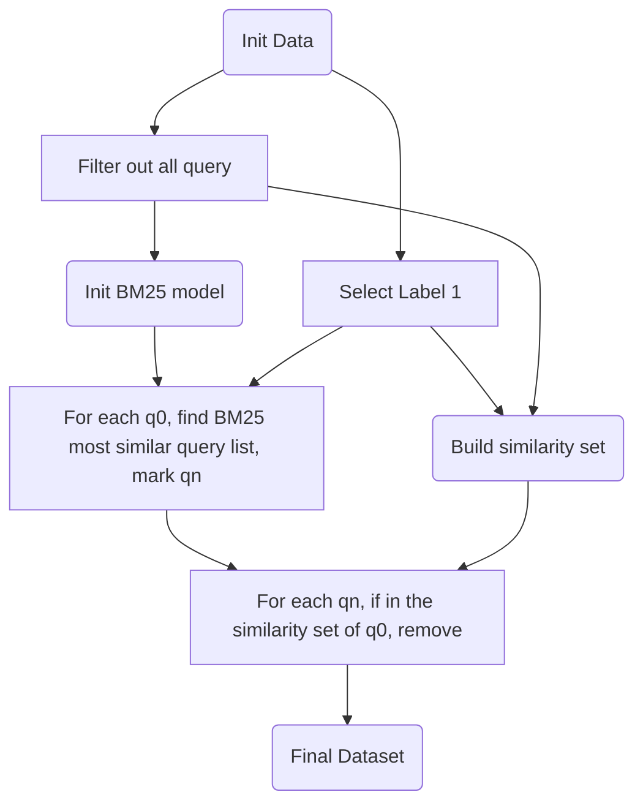

# Q2QDataset

> An open source Chinese query similarity dataset

## Data Overview

The Q2QDataset serves as a training resource for Chinese question answering models. It contains a set of standard questions along with their corresponding answers. During inference, the model compares the user's input question with the standard questions and provides an appropriate answer that addresses the user's query based on the matched standard question. This approach enables the model to effectively respond to user questions by leveraging the existing standard questions and their associated answers.

### Training Dataset

+ `train.json`: include 4174 pairs of data

+ `validate.json`: include 220 pairs of data

The data in the training datasets is processed to the following format:

```json
[{
    "q": "sample query"
    "qa_candidates": [
        [
            "1",
            "similar query"
        ],
        [
            "0",
            "not similar query 1"
        ],
        [
            "0",
            "not similar query 2"
        ],
        [
            "0",
            "not similar query 3"
        ],
        [
            "0",
            "not similar query 4"
        ],
        [
            "0",
            "not similar query 5"
        ],
    ]
}]
```

Each sample query q will be accompanied by 5 follow-up queries, each assigned a binary label indicating its similarity to the sample query. The first follow-up will be a similar query, asking the same thing as the sample query. The subsequent follow-ups will consist of not similar query, addressing different topics or inquiries.

### Testing Dataset

+ `test.json`: including 12500 testing pairs with label indicating if the sample query is similar as the candidate or not.

The data in the testing datasets is processed to the similar format, but for each pair of data, only one candidate will be included:

```json
[
    {
        "q": "sample query",
        "qa_candidates": [
            "query candidate label",
            "candidate query"
        ]
    }
]
```

## Data Process

### Data Source

All data is processed from the Baidu AI studio open source dataset [千言数据集：文本相似度](https://aistudio.baidu.com/aistudio/competition/detail/45/0/task-definition).

### Data Selection



The data selection follows the steps:

1. From the initial dataset filter out all data with label 1.
2. From the initial dataset select out all query(no matter q0 or qa)
3. Build up similarity set indicating the data which having same meaning(If two different q0 have same qa, their are having same meaning)
4. Initial BM25 model using the all query dataset
5. For each q0, match and find all query with high score in BM25 but not in the similar list. Those query will be marked 0 and put into the query pair.
6. Process the query pair into the data format.